# ApiMovies
API prapared for university classes using Node.js.
 
## Table of contents
* [General info](#general-info)
* [Project structure](#project-structure)
* [Modules used](#modules-used)
* [Endpoints](#endpoints)
* [Authors](#authors)

## General info
This projects allows the user to perform basic CRUD operations in a Movie Database. Additionally you are able to sign up, log in and delete the existing account. When you sign up, an email is sent to you as a confirmation. Moreover, you can see currently airing movies and also till when they will be aired.

## Project structure
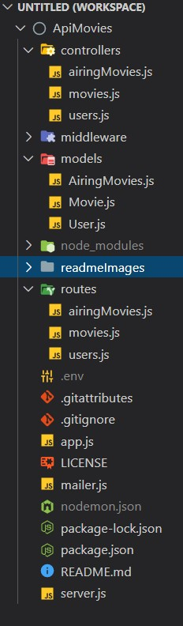 </br>

## Modules used
* NodeJS
* Express
* MongoDB
* Mongoose
* BodyParser
* JsonWebtoken
* Bcrypt
* Nodemailer

## Endpoints
```js
//signing up
router.post('/signup', userController.user_sign_up); 
```
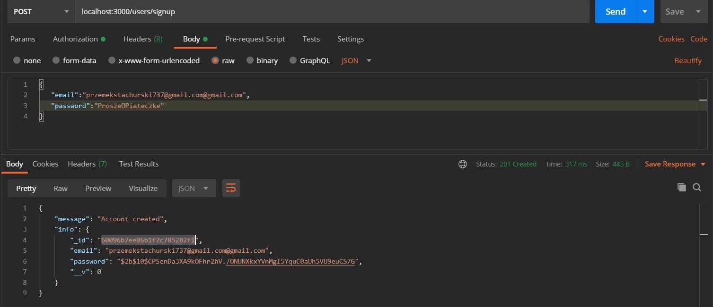 </br>
### Confirmation mail that you get after creating an account.
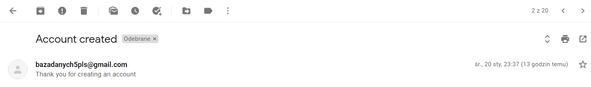 </br>
```js
//deleting user
router.delete('/:userId', userController.user_delete);
```
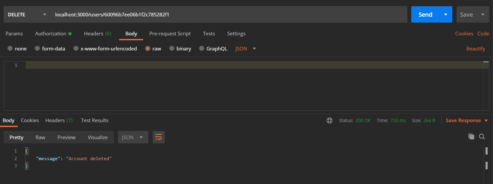 </br>
```js
//logging in
router.post('/login', userController.user_login);
```
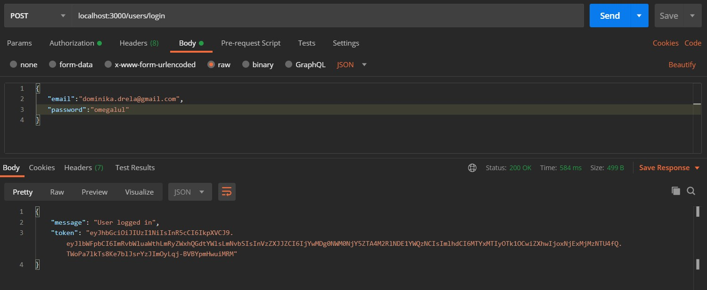 </br>
```js
//listing all movies
router.get('/', movieController.movies_get_all);
```
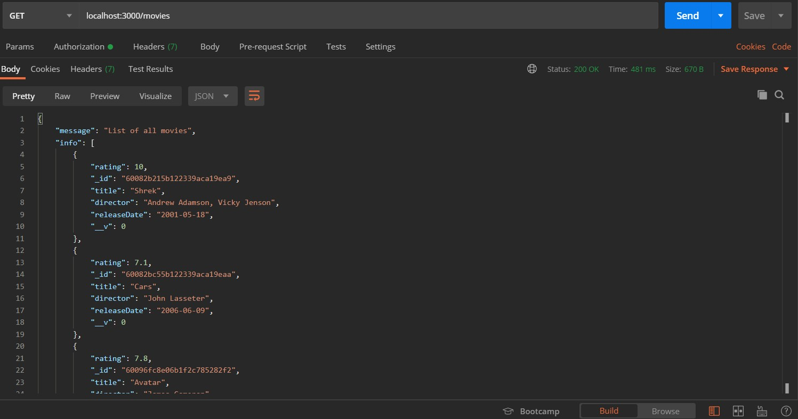 </br>
```js
//adding new movie
router.post('/', authorization, movieController.movies_new);
```
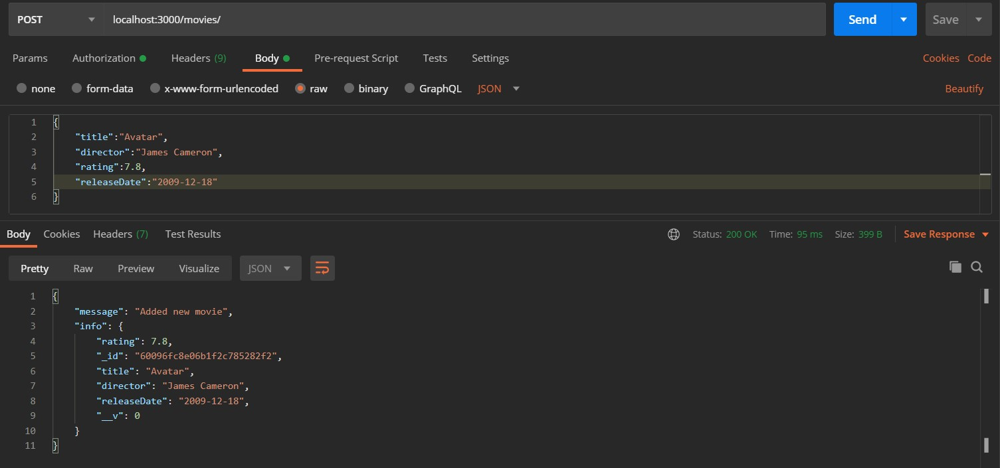 </br>
### You can only add a movie when you are authenticated.
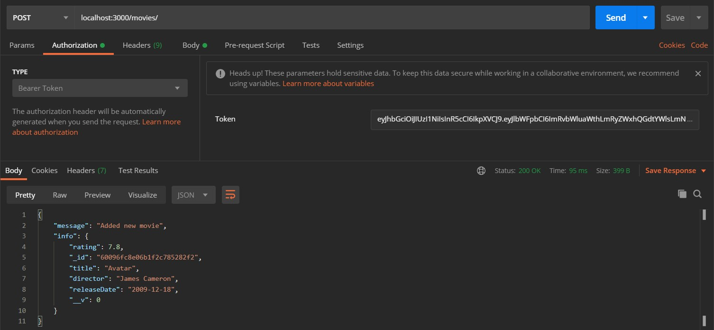 </br>
```js
// details movie with id
router.get('/:movieId', movieController.movies_get_by_id);
```
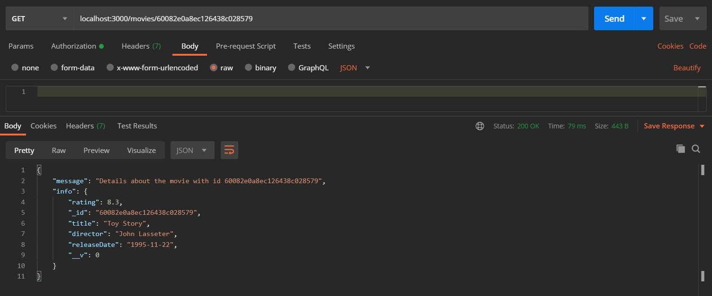 </br>
```js
//changing movie with id
router.patch('/:movieId', authorization, movieController.movies_change);
```
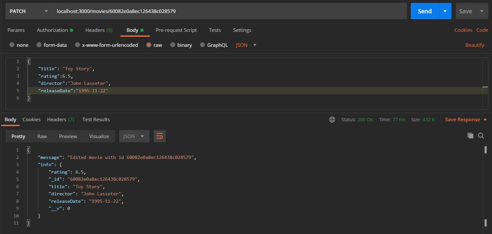 </br>
```js
//deleting movie with id
router.delete('/:movieId', authorization, movieController.movies_delete);
```
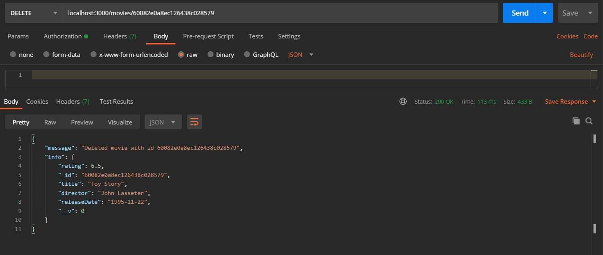 </br>
```js
//listing all currently airing movies
router.get('/', airingMovieController.airingMovies_get_all);
```
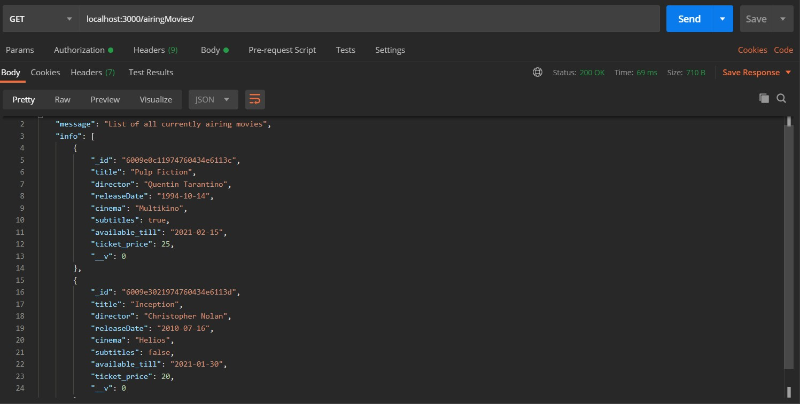 </br>
```js
//adding new currently airing movies
router.post('/', authorization, airingMovieController.airingMovies_new);
```
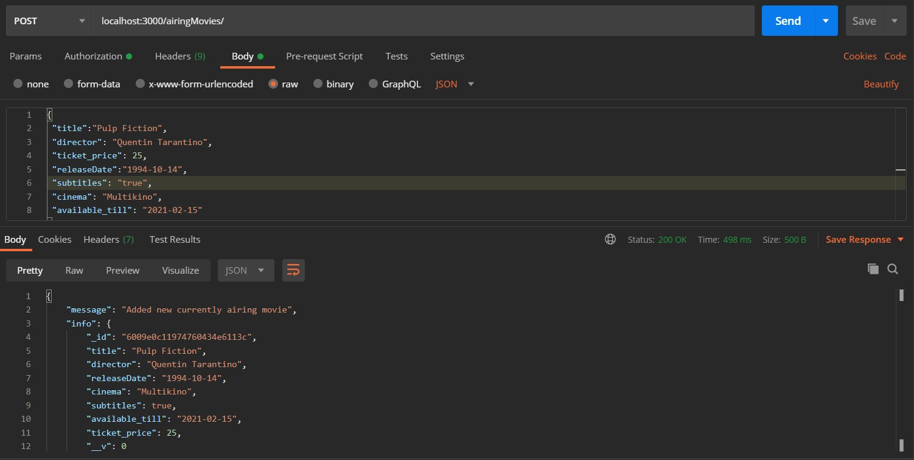 </br>
```js
// details currently airing movies with id
router.get('/:airingMovieId', airingMovieController.airingMovies_get_by_id);
```
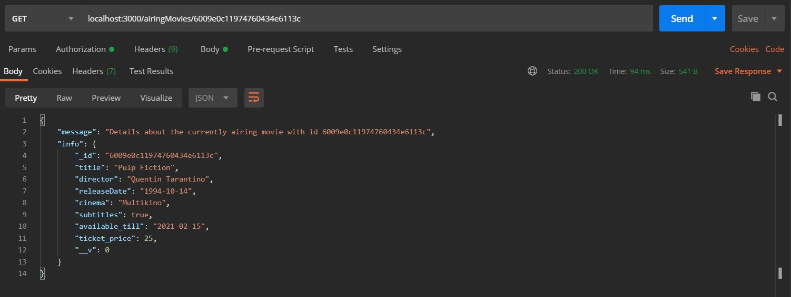 </br>
```js
//changing currently airing movies with id
router.patch('/:airingMovieId', authorization, airingMovieController.airingMovies_change);
```
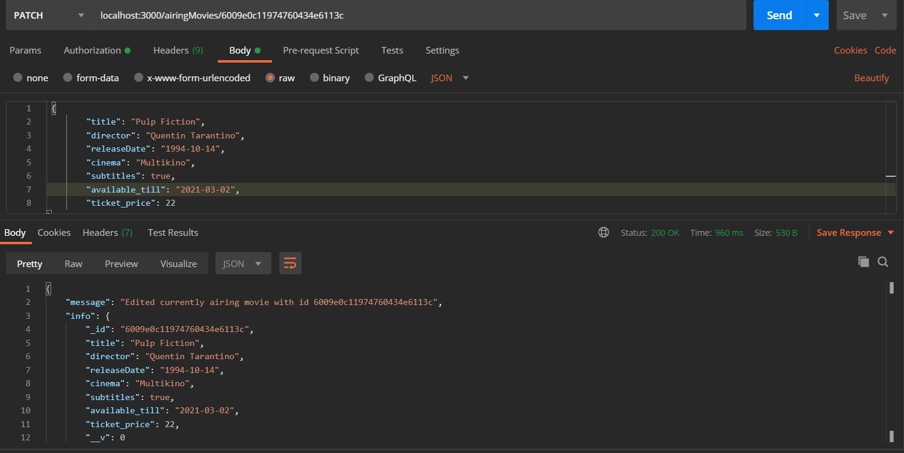 </br>
```js
//deleting currently airing movies with id
router.delete('/:airingMovieId', authorization, airingMovieController.airingMovies_delete);
```
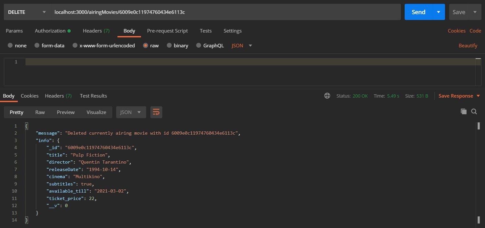 </br>


## Authors
Created by [DrelaDominika](https://github.com/DrelaDominika) and [PrzemyslawStachurski](https://github.com/PrzemyslawStachurski) - feel free to contact us!
